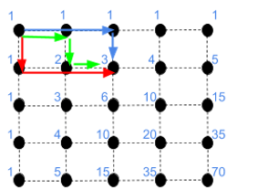

Approach of this solution:
Lets say every point on the grid has its own number of possibilites. First point next to top leftmost point (our starting point) has 1 possibility. We can get there only starting by start point. And same goes all points on first row and first column. So if we say the possibilities of a point is a sum of previous points which we can reach to that point. If we say start point coordinate is (0,0), so the number of possibilities of (1,1) is 2 which is 1+1. Lets calculate (1,2). We can reach to (1,2) from (1,1) and (0,2). So (1,2) = 2 + 1 = 3. And the same goes on for every points until we reach to the bottom rightmost point.

